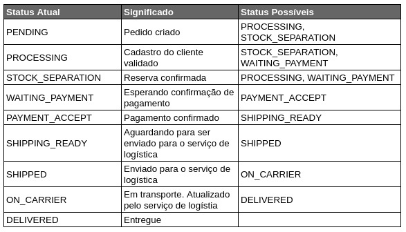

# Sistema de Gestão de Pedidos

## Desafio Tech Challenge - Fase 4 - FIAP

O sistema consiste em 4 serviços, separados em: produto, clientes, pedidos e logística. Este respositório os agrupa.

1. [Cliente](https://github.com/AydanAmorim/costumers-microservice)
2. [Gateway](https://github.com/fysabelah/gateway)
3. [Logística](https://github.com/erickmatheusribeiro/tracking-microservice)
4. [Pedido](https://github.com/fysabelah/ordering-microservice)
5. [Produto](https://github.com/DFaccio/products-microservice)
6. [Registro e descoberta de serviços](https://github.com/fysabelah/registration-discovery-services)

## Tecnologias
* Spring Boot para a estrutura do serviço
* Spring Data JPA para manipulação de dados dos pedidos
* Spring Cloud para comunicação baseada em eventos com outros microsserviços
* PostgreSQL para persistência
* RabbitMQ para mensageria

## Desenvolvedores

- [Aydan Amorim](https://github.com/AydanAmorim)
- [Danilo Faccio](https://github.com/DFaccio)
- [Erick Ribeiro](https://github.com/erickmatheusribeiro)
- [Isabela França](https://github.com/fysabelah)

## Esquema de funionamento entre os serviços

* Cadastro do cliente, onde mesmo pode está desabilitado ou habilitado.
* Cadastro dos produtos, onde um produto pode ter desconto ou não.
  * Para o pedido será necessário criar uma reserva 
* Cadastro das tarifas para gestão de logística.
* Após ambiente configurado, é possível partir para criação de pedido. O payload do pedido considera que a reserva dos sku já
foi criada. Conforme o pedido avança de status, a reserva será confirmada.
  * Para simulação do pagamento, será validado pelo último número do cartão, conforme [mencionado aqui](https://github.com/fysabelah/ordering-microservice/tree/main).
  * Um pedido pode ser cancelado a qualquer momento, contato que não esteja entregue.
    * Ele tentará cancelar entrega e atualizar o estoque dependendo do status atual.
  * O mapa de status segue conforme imagem abaixo.
  
  

## Acesso a documentação

Foi feito uso de um Gateway para comunicação dos serviços, para que apenas o mesmo fosse exposto.
No entanto, por não ter sido possível centralizar o swagger-ui de todos os projetos no gateway, optamos por adicionar os dois servidores.

Portanto, no compose deixaremos aberto a requisição, mas também permitiremos a configuração pelo gateway.

  É possível ver todos serviços registrados em http://localhost:7070

* Clientes
  * [Swagger-UI](http://localhost:7076/doc/customer-management.html)
  * [Gateway](http://localhost:7071/order-management-system/customers-microservice/documentation)
* Pedidos
  * [Swagger-UI](http://localhost:7078/doc/order.html)
  * [Gateway](http://localhost:7071/order-management-system/ordering-microservice/documentation)
* Produtos
  * [Swagger-UI](http://localhost:7077/doc/product-management.html)
  * [Gateway](http://localhost:7071/order-management-system/product-microservice/documentation)
* Transporte
  * [Swagger-UI](http://localhost:7079/doc/tracking.html)
  * [Gateway](http://localhost:7071/order-management-system/tracking-microservice/documentation)

    OBS.: O Swagger-UI não está funcionando ao utilizar o gateway. Porém, funciona no Postman.

## Como executar

O projeto pode ser executado clonando este repositório e digitando o comando abaixo.

    docker compose up